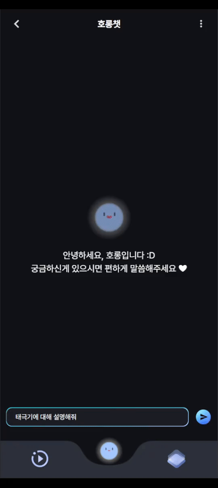
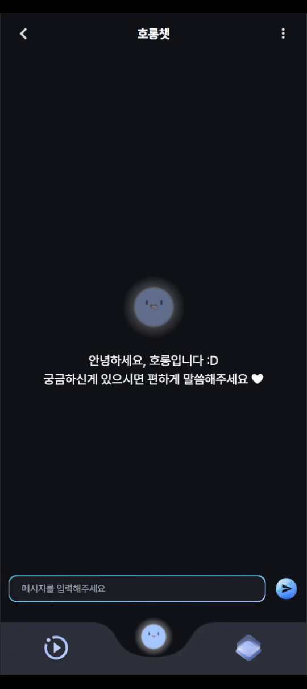
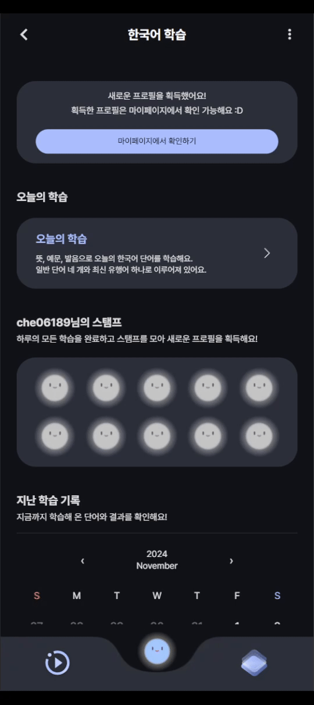
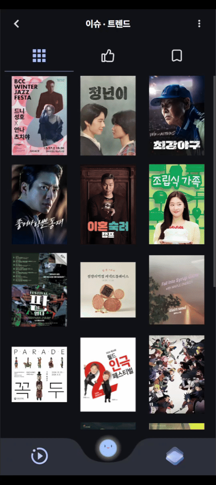
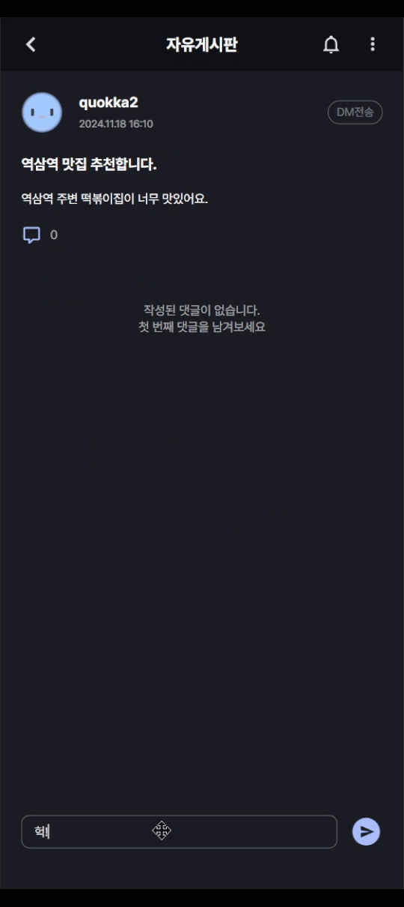

# SSAFY A108 Horong


- 배포 URL : https://horong.kr

## 📅 **프로젝트 기간**

- 2024.10.14 ~ 2024.11.18

## 🙇🏻‍♂️ **팀원소개**

<div align="center">
  
| [이하림](https://github.com/haaazz) |   [박상우](https://github.com/coolfin)  | [최홍석](https://github.com/k-redstone) | [최성철](https://github.com/CSchoice) | [이승주](https://github.com/KristaLEE) |[윤경서](https://github.com/yoonkyungseo) |
| :----------------------------------: | :-----------------------------------: | :-----------------------------------: | :-----------------------------------: | :-----------------------------------: | :-----------------------------------: | 
|||||||
|          DESIGN          |                  FE                  |              FE, INFRA              |              BE, INFRA              |              DATA            |              DATA, INFRA              |
</div>

## 🧑🏻‍💻 개발 관련 기술

### 📋 git 이슈/브랜치 관리

### issue

- 프론트엔드와 백엔드, 데이터는 `label`로 분류한다.
- `assignees`는 이슈 생성자가 스스로 할당한다.
- 이슈 타입

  ```markdown
  feat : `새로운` 기능 추가
  fix : 버그 수정
  hotfix : 치명적인 버그 급하게 수정
  chore : (코드 수정 없는) 설정 변경
  docs : 문서 생성 및 수정
  design : 레이아웃 구현 및 디자인 수정
  refactor : 리팩토링
  remove : 파일/코드 삭제
  merge : 브랜치 병합
  ```

- 작성 예시
  **[타입] 이슈 명**
  - [feat] PWA 구현
  - [design] 랜딩 페이지 레이아웃 디자인

### branch

- 프론트엔드, 백엔드, 데이터는 접두사로 **`fe/ be/ data/`** 를 붙인다.
- 브랜치 생성 시, 영문은 모두 **소문자**를 사용한다.
- git flow 방식을 채용하여 dev branch로 protect한다.
- 완료 된 작업에 대하여 PR 완료 이후 해당 작업 브랜치는 삭제한다.
- 생성 예시
  **분야/타입/#이슈번호\_이슈명**
  - fe/feat/i1_pwa
  - fe/design/i2_landing

### commit

- 영문은 모두 **소문자**를 사용한다.
- 한글도 가능하다.
- 생성 예시
  - docs: TIL 생성
  - feat: PWA setting

### merge

- 영문은 모두 **소문자**를 사용한다.
- 내용은 템플릿을 사용한다.
- 생성 예시
  **분야/타입/#이슈번호 기능명 | 간단한 설명**
  - be/feat/i1_backend cicd
  - fe/design/i2\_랜딩페이지

### 👩🏻‍🔧 **기술 스택**

<div align="left">

### FE

---

#### 🚀 프레임워크 및 라이브러리

  
   
  
  #### 📊 상태 관리
   
  
  
  #### 📡 데이터 요청
  
  
  #### 💄 스타일링
  

#### 🔧 코드 품질 관리

  
  

### BE

---

#### 🚀 프레임워크 및 라이브러리

 
 


#### 📂 DB 및 스토리지

 
 
 


### DATA

---


### INFRA

---

#### 🔗 CI/CD

 
 


#### 💻 모니터링

 


### 🎁 외부 API

---

 
 


## 역할 분담

### 👻이하림

- **기획**
  - JIRA 번다운차트, 스프린트 관리
  - UT(Usability Test) 가이드 제작
  - QA(Quality Assuarance) 가이드 제작
- **디자인**
  - FIGMA 전체 와이어프레인 설계 및 전체 페이지 디자인
  - TailwindCSS 디자인가이드 제공

<br>
    
### 🍊박상우

- **UI 및 기능**
  - 회원가입, 로그인, 마이페이지
  - 이슈 숏폼
  - 한국어 학습
    <br>

### 😎최홍석

- **UI 및 기능**

  - 호롱챗
  - 커뮤니티
  - 환전소
  - FCM 구현

- **Infra**
  - FE docker 빌드 설정
  - FE CI/CD 파이프라인 관리
  - nginx 구성
    <br>

### 🏓최성철

- **BE**
  - Redis를 사용한 환전소 데이터 캐싱 및 유저 검증 토큰 생성
  - Elasticsearch를 사용한 다국어 검색 기능 구현
  - 데이터 파트의 fastapi와 프론트 파트 보안 연결
- **INFRA**
  - 서버 관리 : 백엔드 dev/prod 서버 관리
  - CI/CD 관리 : Docker를 사용해 Jenkins 파이프라인 관리
  - DB 인스턴스 관리 : Mysql, Elasticsearch, Redis Cluster 구축
  - 모니터링 : Prometheus, Grafana를 통한 모니터링

<br>

### 🐱‍🏍이승주

- **한국어 학습**

  - 한국어 슬랭 사이트 및 언어사전을 참고하여 한국어 학습 데이터셋 구성
  - 정답 음성 가이드를 위해 google TTS 를 활용하여 단어 음성 데이터 생성
  - 사용자의 발화 음성을 텍스트로 변환하기 위해 Naver Clova의 STT를 사용하여 사용자 음성을 텍스트로 변환
  - 두 텍스트간의 유사도를 측정하는 Levenshtein 알고리즘을 참고하여 CER 평가지표 생성 로직 작성(기존 CER 로직을 그대로 사용할 경우 100%를 초과하는 경우가 발생하여 정규화과정을 통해 0~1사이로 값을 정규화해주는 과정을 추가하였음)

- **숏폼**

  - 크롤링 및 api 활용으로 popup store, festival, performance, news, ott에 따른 숏폼 컨텐츠 데이터 수집
  - 프롬프트 엔지니어링을 통해 숏폼에 사용될 데이터 요약 및 컨텐츠 소개를 위한 TTS 텍스트 데이터 생성
  - google TTS 모델을 활용하여 각 언어별(한국어, 영어, 중국어, 일본어) 음성 생성

- **숏폼 개인화**

  - 스크랩, 좋아요, 싫어요, 시청시간 로그에 따른 개인화 알고리즘 개발
  - 스크랩/좋아요/시청시간별 + 가중치를 부여하여 유사한 컨텐츠 검색 후, 싫어요 컨텐츠에는 - 가중치를 부여하여 유사한 컨텐츠를 제외하도록 했음.
  - 기존에 봤던 컨텐츠 및 날짜가 지나간 컨텐츠는 제외하도록 했음.

<br>

### 🎯윤경서

- **메인 호롱 챗봇**

  - langchain을 활용하여 rag 기술 구현
  - 한국어 가이드 컨셉 및 언어별 적절한 답변을 위한 프롬프트 엔지니어링
  - 모델 변경 및 파라미터 변경을 통한 실험을 통해 답변 시간단축  
    (임베딩 벡터 생성 시 청크 사이즈 변경, 문서 탐색 방법 변경, openai 모델 변경, 탐색 문서 수 변경, 임베딩 모델 변경)

- **숏폼**

  - 크롤링 및 api 활용으로 popup store, festival, performance, news, ott에 따른 숏폼 컨텐츠 데이터 수집
  - 프롬프트 엔지니어링을 통해 숏폼에 사용될 데이터 요약 및 컨텐츠 소개를 위한 TTS 텍스트 데이터 생성
  - google TTS 모델을 활용하여 각 언어별(한국어, 영어, 중국어, 일본어) 음성 생성

- **숏폼 개인화**

  - 스크랩, 좋아요, 싫어요, 시청시간 로그에 따른 개인화 알고리즘 개발
  - 스크랩/좋아요/시청시간별 + 가중치를 부여하여 유사한 컨텐츠 검색 후, 싫어요 컨텐츠에는 - 가중치를 부여하여 유사한 컨텐츠를 제외하도록 했음.
  - 기존에 봤던 컨텐츠 및 날짜가 지나간 컨텐츠는 제외하도록 했음.

## 📖 **주요 기능**

### 1. 호롱챗

<details>
  <summary>호롱챗</summary>
  
</details>

### 2. 한국어 학습

<details>
  <summary>한국어 학습 페이지</summary>
  
</details>
<details>
  <summary>지난 기록 보기</summary>
  
</details>

### 3. 한국 트렌드 / 이슈 숏폼

<details>
<summary> 한국 트렌드 / 이슈 숏폼 페이지</summary>

  
</details>

### 4. 사설환전소

<details>
<summary>사설환전소 페이지</summary>

</details>

### 5. 커뮤니티

<details>
<summary>커뮤니티페이지</summary>

</details>

## ⚒️ **프로젝트 후기**

### 👻이하림

- 한국인 대상으로 하는 서비스도 만들기 어려운데 외국인을 대상으로 하는 다국어 서비스를 만드느라 저도, 저희 팀원도 레퍼런스 찾느랴, 번역 하느랴 참 많이 고생한 것 같습니다. 아쉬운 부분이 아예 없다고 말할 수는 없지만 그래도 열심히 한 만큼 완성도 높고 자랑스러운 서비스가 만들어진 것 같아서 뿌듯합니다. FE개발에 살짝 참여해보기도 했고, 다크 모드와 외국인 대상 서비스의 UI에 대해서 깊게 고민도 해보았으며 PM역할을 맡으면서 일정이 밀리지 않도록, WBS를 거듭 수정하며 Jira 포인트를 분배하기도 한 알찬 프로젝트였습니다. 유능하고 재밌고 야무진 팀원들 사이에서 기술적인 부분도 많이 배울 수 있었고, 정말 즐겁게 프로젝트했습니다! 담에 또 맛난거 먹으러 가자 108배(수행정진) 고생 많았고 고마웠다!!

<br>

### 🍊박상우

- 다국어를 지원하는 첫 프로젝트여서 그런지 기획 단계부터 개발 과정까지 신선한 경험이었다. 특히 한국어로 작성하더라도 유저의 언어 저장 상태에 따라 다른 언어로 번역해서 보여주는 과정이 재미있었다.
  오디오 객체를 처음 다뤄봤는데 이미지와 크게 다른 점이 없어서 쉽게 구현할 수 있었던 것 같다. S3에 올려서 관리했다.
- 상태관리에서 캐싱된 데이터와 fetch해오는 데이터를 어떻게 다르게 받아와야할지에 대한 고민이 많았다. 현 프로젝트에서는 staleTime을 조정해서 해결하였는데, 이는 편법인 것 같아 queryClient공부의 필요성을 깨달았다. 추후 리팩토링 과정에서 이를 고칠 예정이다.
- 기기에 따라 view가 달라지지 않도록 충분히 고려해서 짰음에도 불구하고 버그가 많이 생겼다. 앞으로 개발할 모바일 서비스에 대해서는 다양한 공기계를 준비하여 이러한 상황에 대비해야겠다고 느꼈다.
  기획적인 부분에서는 1차 배포와 피드백을 받고 실제 배포까지 진행할 계획이었는데 QA를 거치고 기능을 구현하다보니 생각보다 고도화를 하는데 시간이 많이 소요되어 이 부분을 진행하지 못한 점이 아쉬웠다.
  <br>

### 😎최홍석

- 이번 프로젝트에서 SSE를 처음 써보았는데, 생각보다 제약이 있었다는 것과 연결되고 메시지를 받아올 때까지의 연결 시간을 줄이는 것이 어려웠습니다. 항상 커뮤니티(SNS)형 서비스를 개발하면서 느낀 점이지만 유저의 타입에 따라 다양한 분기처리를 하면서 에러 핸들링이 어려웠던 것 같습니다. 이번에도 같은 어려움을 느꼈지만, 거듭된 프로젝트 속에서 어디까지 에러핸들링의 고려 범위를 최대한 고려해보았습니다.
- 데이터 패칭 로직에서 server state를 tanstack-query를 사용해 처리를 하였는데, 값이 바로 변경되어야 하는 로직이 있는경우 무조건 다시 Refetching을 해야했습니다. 이때, 이미 캐시된 데이터를 어떻게 관리 해야할지 고민을 많이 했던 것 같습니다. staleTime을 없애기도 하고, reset을 하기도 하고 다양한 방법을 고민하고 적용해보았지만, 딱 적당한 방식이 나오지는 않았습니다. 추후 더 고민 해볼 예정입니다.

<br>

### 🏓최성철

-이번 프로젝트를 통해 스프링부트의 전체 로직을 이해하며 백엔드 개발을 혼자서 완성할 수 있었습니다. 또한, 인프라를 직접 구축하면서 네트워크에 대해 깊이 배우는 계기가 되었습니다. 이러한 경험을 통해 개발 프로세스 전반에 대한 자신감을 얻었고, 기술적 성장의 기회를 만들 수 있었습니다.
<br>

### 🐱‍🏍이승주

먼저 떠나서 미안합니다..!

<br>

### 🎯윤경서

- 싸피에서 진행한 프로젝트 중 다른 사람과 같은 파트를 맡아서 했던 프로젝트는 처음이라 협업하는 경험이 새로웠다. git과 지라로 함께 관리하고 협업하면서 서로의 진행상황을 확인하면서 어떻게 하면 효율적으로 협업할 수 있을 지 많이 고민하게 된 것 같다. 같은 파트를 맡은 덕분에 git 활용 능력이나 충돌 관리와 같은 경험들을 해볼 수 있어 좋았다.

- AI를 적용해볼 수 있었다는 점이 좋았다. AI를 서비스화 해보면서 성능과 속도를 모두 고려했어야 했던 점이 가장 흥미로웠다. 조금 더 시간이 있었다면 시간 단축에 조금 더 시간을 써볼 수 있었을 것 같은데 시간 단축에 시간 투자를 많이 하지 못했던 점이 아쉬운 점으로 남는 것 같다. AI를 사용하면서 좋았던 점은 다양한 실험을 해보면서 기술의 장단점을 비교해보고 자연스럽게 기술 공부도 할 수 있었다는 점이 좋았다.

- 사용자 피드백을 많이 받아보지 못했던 점도 아쉬운 것 같다. 팀원의 지인 일부에게 피드백을 받긴 했지만 이 앱 대상자가 우리가 잘 알지 못하는 외국인이기 때문에 일정 기간 동안 더 많은 사용자 피드백을 받아볼 수 있었으면 더 좋았을 것 같다는 아쉬움이 남는다. 숏폼 개인화와 같은 데이터 파트는 사용자의 경험을 기반으로 더 발전할 수 있는 서비스라고 생각하는데 기회가 된다면 이 부분을 조금 더 고도화 할 수 있도록 발표가 끝나더라도 배포를 해보면 좋을 것 같다.
  <br>
